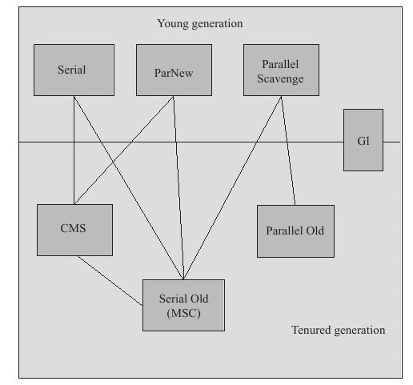

# 垃圾收集器
收集算法是内存回收的方法论，而垃圾收集器就是内存回收的具体实现。

如下是Hotspot虚拟机的垃圾收集器，两个收集器有连线代表可以搭配使用。

 

#### Serial

- 目标：

- 垃圾收集算法：

- 适用范围：

- 优点：

- 缺点：

 

#### ParNew

- 目标：

- 垃圾收集算法：

- 适用范围：

- 优点：

- 缺点：

 

#### Parallel Scavenge

- 目标：

- 垃圾收集算法：

- 适用范围：

- 优点：

- 缺点：

 

#### Serial Old

- 目标：

- 垃圾收集算法：

- 适用范围：

- 优点：

- 缺点：

 

#### Parallel Old

- 目标：

- 垃圾收集算法：

- 适用范围：

- 优点：

- 缺点：

 

#### CMS

- 目标：

- 垃圾收集算法：

- 适用范围：

- 优点：

- 缺点：

 

#### G1

- 目标：

- 垃圾收集算法：

- 适用范围：

- 优点：

- 缺点：

 

 

#### 垃圾收集器的修改方式

以下表格汇总了各种回收器的分类、特点和修改参数：

| 名称                | 修改参数                                       | 特点                                                                                                                                                                                                                                     |
|-------------------|--------------------------------------------|----------------------------------------------------------------------------------------------------------------------------------------------------------------------------------------------------------------------------------------|
| Serial            | -XX:+UseSerialGC                           | 用于新生代的单线程收集器，采用复制算法进行垃圾收集。Serial 进行垃圾收集时，所有的用户线程必须暂停（Stop The World）。                                                                                                                                                                  |
| ParNew            | -XX:+UseParNewGC                           | Serial的多线程版本，在单核CPU环境并不会比Serial更优，它默认开启的收集线程数和CPU核数，可以通过-XX:ParallelGCThreads来设置垃圾收集的线程数。                                                                                                                                              |
| Parallel Scavenge | -XX:+UseParallelGC jdk1.7、jdk1.8 新生代默认使用   | 用于新生代的多线程收集器，ParNew的目标是尽可能缩短垃圾收集时用户线程的停顿时间，Parallel Scavenge的目标是达到一个可控制的吞吐量。通过-XX:MaxGCPauseMillis来设置收集器尽可能在多长时间内完成内存回收，通过-XX:GCTimeRatio来精确控制吞吐量。                                                                                     |
| Serial Old        | -XX:+UseSerialOldGC                        | Serial的老年代版本，采用标记-整理算法单线程收集器。                                                                                                                                                                                                          |
| CMS               | -XX:+UseConMarkSweepGC                     | 一种以最短回收停顿时间为目标的收集器，尽量做到最短用户线程停顿时间。CMS是基于标记-清除算法，所以垃圾回收后会产生空间碎片，通过-XX:UseCMSCompactAtFullCollection开启碎片整理（默认开启）。用-XX:CMSFullGCsBeforeCompaction设置执行多少次不压缩（不进行碎片整理）的Full GC之后，跟着来一次带压缩（碎片整理）的Full GC。-XX:ParallelCMSThreads：设定CMS的线程数量。  |
| Parallel Old      | -XX:+UseParallelOldGC jdk1.7、jdk1.8老年代默认使用 | Parallel Scavenge的老年代版本，使用-XX:ParallelGCThreads限制线程数量。                                                                                                                                                                                 |
| G1                | -XX:+UseG1GC jdk1.7以后才提供，jdk1.9默认选项  | 一款全新的收集器，兼顾并行和并发功能，能充分利用多CPU资源，运行期间不会产生内存碎片。通过-XX:ParallelGCThreads设置限制线程数量；-XX:MaxGCPauseMillis设置最大停顿时间。                                                                                                                              |
