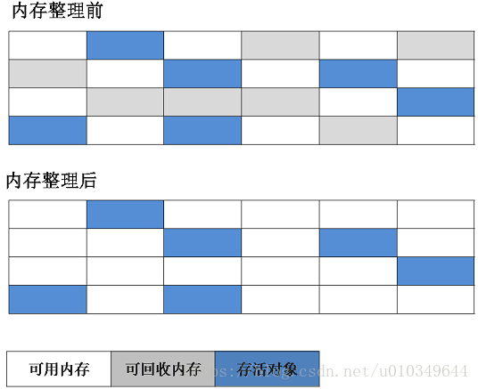
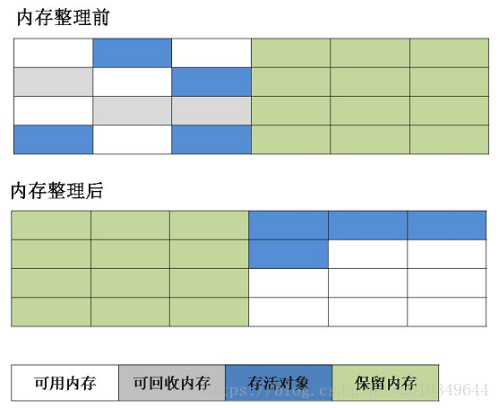
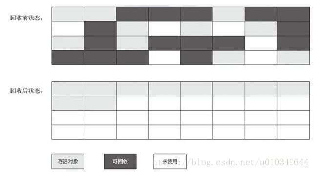

# 垃圾回收算法
从如何判定对象消亡的角度，分为两类：
* **引用计数式垃圾收集**（Reference Counting GC）或称直接垃圾收集

* **追踪式垃圾收集**（Tracing GC）或称间接垃圾收集

  

## 分代收集理论
分代收集理论（Generational Collection），该理论奠定多款垃圾收集器的一致设计原则：即收集器应将Java堆划分出不同的区域，然后将回收对象依据其年龄（年龄即对象熬过垃圾收集过程的次数）分配到不同的区域之中存储。

该理论建立在两个假说上，后续根据其缺点（由于对象不是孤立的，对象之间会存在跨代引用）补充了跨代引用假说：
* **弱分代假说**：绝大多数对象都是朝生夕灭的

* **强分代假说**：熬过越多次垃圾收集过程的对象越难以消亡

* **跨代引用假说**：跨代引用即弱分代区域的对象引用强分代区域的对象（或相反引用），相对于同代引用来说仅占极少数

  

## 标记-清除算法
**描述**：Mark-Sweep。算法分为标记、清除两个部分，根据算法标记出所有需要回收的对象，在标记完成后，统一回收被标记的对象。
也可以反过来，标记存活的对象，统一删除未被标记的对象。

**缺点**：
* 执行效率不稳定。如果Java堆中包含大量对象，且大部分都是需要回收的，这时必须进行大量的标记和清除，导致标记和清除的执行效率都随对象数量增长而降低。

* 内存空间碎片化问题。标记和清除之后会产生大量的不连续的内存碎片，空间碎片太多可能导致以后分配较大对象时无法找到足够的连续空间而不得不提前触发另一次垃圾回收操作。

**适用范围**：适合在老年代进行垃圾回收，比如CMS收集器就是采用该算法进行回收的。

  

## 标记-复制算法
描述：Mark-Copying。又称复制算法。它先将可用的内存按容量划分为大小相同的两块，每次只是用其中的一块。当这块内存用完了，就将还存活着的对象复制到另一块上面，然后把已经使用过的内存空间一次清理掉。

**优点**：
* 这种算法不用考虑空间碎片的复杂情况，只要移动堆顶指针，按顺序分配内存即可。

* 这种算法实现简单，运行高效。

**缺点**：
* 在对象存活率较高时，就要进行较多的复制操作，效率将会降低。

* 此外，如果不想浪费50%的空间，就需要有额外的空间进行分配担保。

> **改进**：由于新生代都是朝生夕死的，所以不需要1：1划分内存空间，可以将内存划分为一块较大的Eden和两块较小的Suvivor空间。
> 每次使用Eden和其中一块Survivor。当回收的时候，将Eden和Survivor中还活着的对象一次性地复制到另一块Survivor空间上，最后清理掉Eden和刚才使用过的Suevivor空间。其中Eden和Suevivor的大小比例是8：1。
> 缺点是需要老年代进行分配担保，如果第二块的Survovor空间不够的时候，需要对老年代进行垃圾回收，然后存储新生代的对象，这些新生代当然会直接进入来老年代。

**适用范围**：适合新生代区进行垃圾回收。serial new，parallel new和parallel scanvage收集器，就是采用该算法进行回收的。

  

## 标记-整理算法
**描述**：Mark-Compact。分为标记和整理两个阶段：首先标记出所有需要回收的对象，让所有存活的对象都向空间的一端移动，然后直接清理掉端边界以外的内存。
与标记-清除算法的差异在于，前者是一种非移动式的回收算法，后者是移动式的。

**缺点**：
* 移动存活对象并更新所有引用这些对象（由于内存进行了移动，那么引用该对象的指针也会发生变化）的地方都会进行一次更新，且这种对象移动操作必须全程暂停用户应用程序才能进行。如果存活对象过多，那么这次操作的负担势必很大

**根据缺点的权衡**：是否移动对象都存在弊端，移动则内存回收时更复杂，不移动则内存分配时更复杂。
> 从垃圾收集的停顿时间来看：不移动对象停顿时间更短，甚至不停顿
>
> 从整个程序的吞吐量来看：移动对象更划算。因为内存分配和访问相比垃圾收集频率要高得多。不移动对象则在这部分的耗时增加，总吞吐量仍然是下降的。

**适用范围**：适合老年代进行垃圾收集，Parallel Old（针对parallel scanvange gc的） gc和Serial old收集器就是采用该算法进行回收的。