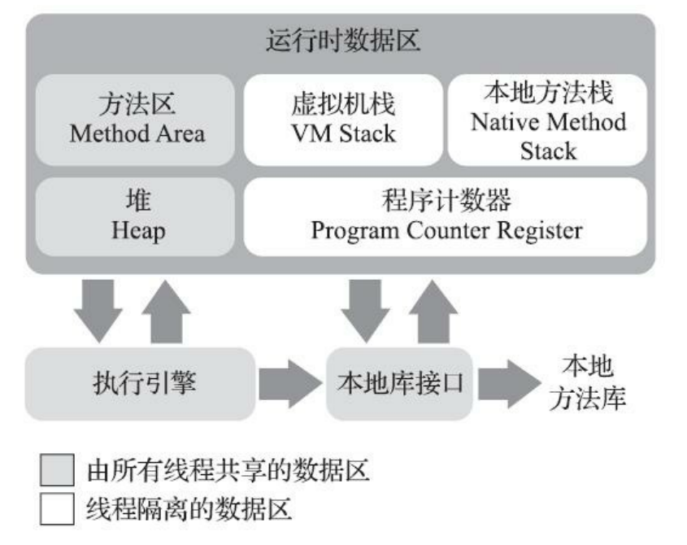

# JVM内存结构

## 概览

其实大体上Java把内存分为两块，堆和非堆。

Java 虚拟机具有一个堆，堆是运行时数据区域，所有类实例和数组的内存均从此处分配。堆是在 Java 虚拟机启动时创建的。在JVM中堆之外的内存称为非堆内存(Non-heap memory)。

简单来说堆就是Java代码可及的内存，是留给开发人员使用的；非堆就是JVM留给自己用的，
所以方法区、JVM内部处理或优化所需的内存(如JIT编译后的代码缓存)、每个类结构(如运行时常数池、字段和方法数据)以及方法和构造方法的代码都在非堆内存中。

栈解决程序的运行问题，即程序如何执行，或者说如何处理数据；堆解决的是数据存储的问题，即数据怎么放、放在哪儿。

  

## 程序计数器：Program Counter Register

**作用**：是一块较小的内存空间，可以被看作当前线程所执行的字节码的行号指示器。字节码解释器工作时就是通过改变这个计数器的值来选取下一条需要执行的字节码指令，它是程序控制流的指示器。

此外，Java虚拟机的多线程是通过线程轮流切换、分配处理器执行时间的方式来实现，为了线程切换后能恢复到正确的执行位置，每个线程都会拥有一个独立的程序计数器独立存储各自的计数器值。各线程之前计数器互不影响。

  

## Java虚拟机栈：Java Virtual Machine Stack

**概览**：VMStack也是线程私有的，它的生命周期与线程相同。

**作用**：虚拟机栈描述的是Java方法执行的线程内存模型。每个方法被执行时，虚拟机会同步创建一个栈帧(Stack Frame)，每个方法被调用直至执行完毕的过程，就对应着一个栈帧在虚拟机栈中入栈到出栈的过程。

>虚拟机栈中的元素：栈帧：Stack Frame。用于存储局部变量表、操作数栈、动态连接、方法出口等信息。

>局部变量表：存放编译期可知的各种Java虚拟机基本数据类型、引用类型和returnAddress类型（指向了一条字节码指令的地址）。这些数据类型在局部变量表中的存储空间以局部变量槽（Slot）表示。除了long和double占用两个槽外，其他都只占一个。局部变量表的内存空间在编译期就完成分配了，且在运行期不会改变；

  

## 本地方法栈：Native Method Stack
**作用**：本地方法栈与虚拟机栈的作用相似，区别在于本地方法栈是为虚拟机使用到的native方法服务；而虚拟机栈是为执行Java方法（也就是字节码）服务。

  

## Java堆：Java Heap

**概览**：Java堆是虚拟机管理的内存的最大一块，它是被所有线程共享的一块区域。它是垃圾收集器管理的内存区域，也被称为GC堆（Garbage Collected Heap）。

**作用**：Java堆所管理的内存区域的作用就是存放对象实例。Java几乎所有的对象实例都在这里分配内存。

>内存空间：Java堆可以处于物理上不连续的内存空间中，但在逻辑上他们应该被视为连续的。但对于大对象（典型的如数组对象），多数虚拟机实现出于实现简单、存储高效的考虑，很可能会要求连续的物理内存空间。主流虚拟机的Java堆都是可以扩展的，可以通过参数-Xmx和-Xms设定。

  

## 方法区：Method Area

**概览**：与Java堆一样，都是线程共享的内存区域。虽然在逻辑上方法区是Java堆的一个逻辑部分，但是它有一个别名“非堆”Non-Heap，用以于Java堆区分开来。

**作用**：用于存储已被虚拟机加载的类型信息、常量、静态变量、即时编译器编译后的代码缓存等数据。

>内存空间：与Java堆一样，此外它甚至还可以选择不实现垃圾收集（这个区域的内存回收目标主要是针对常量池的回收和对类型的卸载）。

  

## 常量池表：Constant Pool Table

**作用**：Class文件中除了有类的版本、字段、方法、接口等描述信息外，还有一项信息就是常量池表（Constant Pool Table）。它用于存放编译期生成的各种字面量与符号引用（例如String s = "str"; ）,这些内容将在类加载后放到方法区的运行常量池中。

  

## 运行时常量池：Runtime Constant Pool

**概览**：是方法区的一部分。JDK7的HotSpot把放在永久代的字符串常量池、静态变量移至了Java堆中。

**作用**：与常量池表相比，运行时常量池具备动态性，运行期间也可以将新的常量放入池中，比如String的intern()方法。
