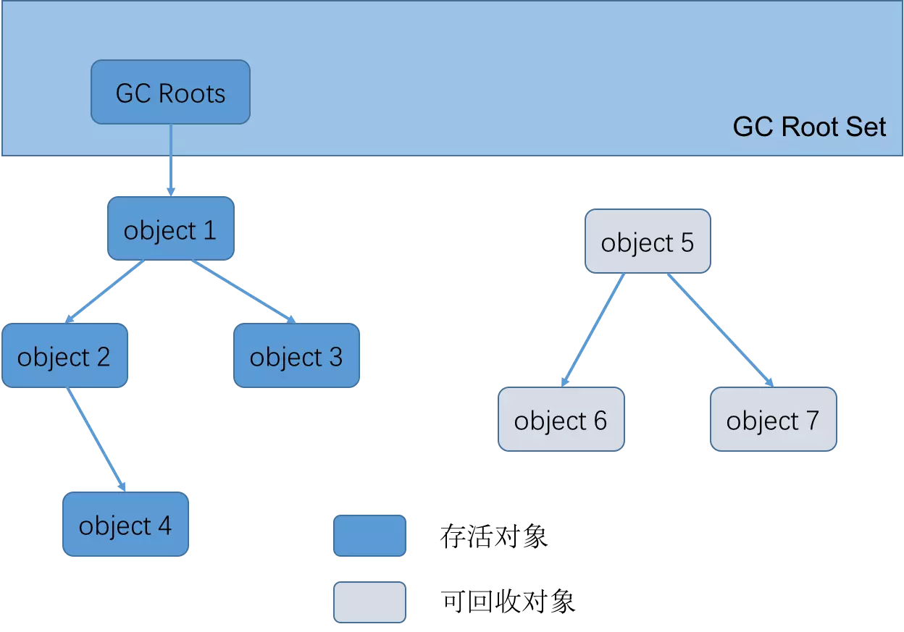

# 判断对象是否回收算法

目前主流的商用程序语言，都是通过可达性分析算法来判定对象是否存活。redis的垃圾回收机制使用了引用计数回收。

## 引用计数算法
**描述**：在对象中添加一个对象引用技术器，每当有一个地方引用时计数器加一，当引用失效时，计数器减一。

**优点**：原理简单，判定效率很高。

**缺点**：会占用一定的额外空间用以计数；该算法有很多额外的情况需要考虑，意味着需要大量额外的处理才能正常工作，比如对象之间的相互引用问题。

  

## 可达性分析算法
**描述**：通过一系列GC Roots的根对象作为起始节点集，从这个节点开始，根据引用关系向下搜索，搜索过程所走过的路程称为引用链（Reference Chain），如果某个对象到GC Roots间没有任何引用链（从GC Roots到这个对象不可达时），则证明这个对象是不可能的再被使用的。

GC Roots包括如下几种固定对象：
> 
>在虚拟机栈中，引用的对象（栈帧中的本地变量表，譬如正在运行方法中的参数、局部变量、临时变量等）
> 
>在本地方法栈中JNI引用的对象（Native方法）
> 
>在方法区中，类静态属性引用的对象（譬如Java类中的引用类型静态变量）
> 
>在方法区中，常量引用的对象（譬如字符串常量池里的引用）
> 
>在虚拟机内部的引用，如基本数据类型对应的Class对象，一些常驻的异常对象（OOM NullPE），类加载器等
> 
>所有被同步锁持有的对象（synchronized关键字）
> 
>反映Java虚拟机内部情况的JMXBean、JVMTI中注册的回调、本地代码缓存等
> 
>其他临时性加入的对象（可能用于分代收集和局部回收）

