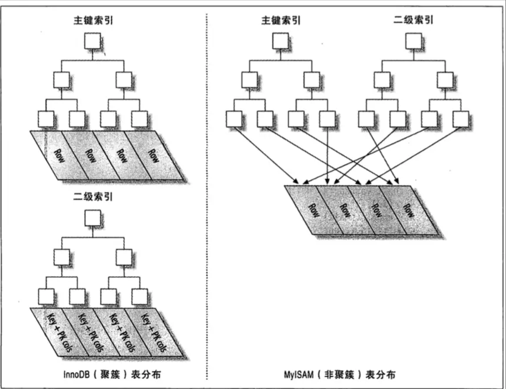

#索引的基础知识

## 索引是什么
索引(index)在MySQL中又叫作键“key”，是存储引擎用于快速找到记录的一种数据结构。索引能让MySQL以最高效、扫描行数最少的方式找到需要的记录。

  

---

## 实现索引的数据类型

- B-Tree索引

- B+Tree索引

- 哈希索引

- 空间数据索引R-Tree

- 全文索引

  

---

## MySQL中索引的类型
**概览**：

数据库索引分为两大类：聚簇索引以及非聚簇索引（也称二级索引）。聚簇索引的索引顺序与行数据的物理顺序是一致的，反之就是非聚集索引。这两种索引实际上是由存储引擎实现的。

 

**聚簇索引与非聚簇索引**
 
- InnoDB的主键索引
 
> 在InnoDB中主键索引属于聚簇索引，非叶子节点保存了索引列以及下级节点的指针，而叶子节点保存了行数据、事务ID等。
>  
> 主键索引保存的顺序和叶子节点的顺序总是保持一致的，当索引的位置发生改变时，保存在物理磁盘中的叶子节点的行数据也会相应改变；
>  
> 由于数据行无法放在两个不同地方，索引一个表只能有一个聚簇索引，而可以有多个非聚簇索引，因此InnoDB中，除了聚簇索引外的索引实际上都是非聚簇索引。
 
- MyISAM的主键索引
 
> 而MyISAM的主键索引属于非聚簇索引，它的表数据是按照行号递增的方式按顺序存储插入的，其叶子节点实际上保存的是指向这个数据表的行号指针，因此当索引位置发生改变时，改变的其实是叶子节点在树中的位置，其行数据实际上是不会改变的；

 

**聚簇索引的优缺点**

**优点**：

- 数据访问更快，索引和数据都保存在同一个BTree中，因此获取数据通常比非聚簇索引（非聚簇索引会根据指针进行再次查表的操作）更快；

- 将相关数据保存在一起，可以有效的避免某些情况下的随机I/O（得益于物理顺序与索引顺序相同）

**缺点**：

- 插入速度依赖于插入顺序。按照主键的插入顺序是加载数据到表中的最快方式。譬如自增主键插入1，2，3……那么它的插入对树的操作影响是最小的，它将会做最小树旋转操作；

- 表插入新行、主键更新导致移动行数据时，有可能产生页分裂（page split）的问题，从而占用更多磁盘空间；

- 更新列的代价很高，因为聚簇索引会强制InnoBD将每个被更新的行移动到新位置（个人理解，实际上索引位置变更才会移动位置，不然索引没变更，那么行又需要移动到哪去）

- 可能导致全表扫描变慢，尤其是行比较稀疏的时候，获取页分裂导致数据存储不连续的时候。

 

**索引的优点（B-Tree）**

- 让服务器快速的定位到表的指定位置。

- 大大减少了服务器需要扫描的数据量

- 可以帮助服务器避免排序和临时表

- 可以将随机I/O变为顺序I/O（就访问内存的数据而言）

 

**什么时候用到索引**

- 总的来说，当索引帮助存储引擎快速查找到记录带来的好处大于期带来的额外工作时，索引才是最有效的。

- 对于非常小的表来说，大部分情况下全表扫描更有效。

- 对于中到大型的表，索引就很有效。

- 但对于特大型的表（如TB级别的数据），建立和使用索引的代价将随之增长。这个时候可以考虑分区，而不是通过索引来一条记录一条记录的匹配。
