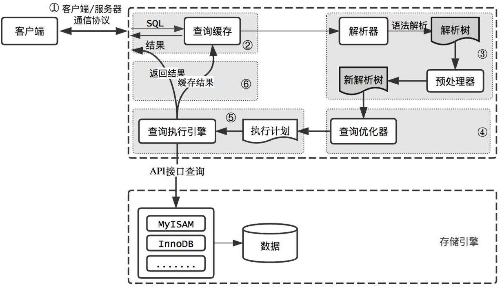

## 执行流程图

  

---

## MySQL逻辑构架

- 外部：客户端链接（半双工方式）

- 上层：连接池
> 连接处理、授权认证、安全等操作

- 核心服务：SQL接口  解析器  查询缓存  查询优化器
> 查询、解析、分析、优化、缓存以及所有内置函数的处理，所有跨存储引擎的功能都在这一层实现：存储过程、触发器、视图等。

- 存储引擎：外部API调用合适的存储引擎
> 负责MySQL中的数据存储和提取。

 

### MySQL客户端/服务端通信

半双工模式

客户端用一个单独的数据包将查询传给服务器

一般，服务器响应给用户的数据通常很多，由多个数据包组成。

 

### MySQL连接池
MySQL服务器将任务发送到线程池，由线程池选择空闲的线程执行查询任务

 

### 查询缓存

如果查询缓存是打开的，那么MySQL会优先检查这个查询是否命中查询缓存中的数据。

这个检查是通过一个对大小写敏感的哈希查找实现的（上一次查询保存查询结果时，会将查询语句进行消息摘要）。

 

### 语法解析和预处理

语法解析器通过关键字将SQL语句进行解析，并生成一颗对应的”解析树“，同时解析器还将使用MySQL语法规则验证和解析查询。

>比如：验证是否使用错误的关键字、使用关键字的顺序是否正确、验证引号是否能前后正确匹配。

预处理器则根据MySQL规则进一步检查解析树是否合法。接着预处理器会验证用户权限。验证完毕后，这一步将生成一个新的解析树。

>比如：检查数据表和数据列（属性）是否存在，以及名字和别名是否有歧义。

到这一步，语法树被认为是合法的了。接下来就由优化器将其转化成执行计划。

 

### 查询优化器
1. **作用**

一条查询有多种执行方式，最后都返回相同的结果。优化器的作用就是找到这其中最好的执行计划。

 

2. **如何选择优化**

MySQL使用基于成本得优化器。它将尝试预测一个查询使用某种执行计划时的成本，并选择其中的一个执行。

> 查看优化器认为查询的成本：show status like 'Last_query_cost';

 

3. **影响优化的因素**

- 每个表或者索引的页面个数

- 索引的基数

- 索引和数据行的长度

- 索引分布情况

- 并不考虑缓存

 

4. **导致优化器选择错误执行计划的因素**

- 统计信息不准确。

- 执行计划中的成本并不等同于实际执行的成本

- MySQL基于成本模型选择最优的计划，而非实际执行时间的长短判断

- MySQL从不考虑其他并发执行的查询

- 有时会基于固定规则。如：存在全文搜索的MATCH()子句。

- 不考虑不受其控制的操作成本：执行存储过程、用户自定义函数

 

5. **优化策略分类**

**静态优化**：静态优化可以直接对解析树进行分析，并直接优化。优化器可以通过简单的代数变换将WHERE条件转换成一种等价形式。静态优化在第一次完成后就一直有效，即使使用不同的参数执行查询也一直有效。可以认为是一种”编译时优化“。

**动态优化**：和查询的上下文以及其他很多因素有关。例如where条件中的取值、索引中条目对应的数据行数等。这需要每次查询的时候都重新评估，可以认为是一种”运行时优化“。

 

6. **优化的类型**
- 重新定义关联表的顺序

- 将外连接转化为内连接

- 使用等价变换规则

- 优化MIN() MAX()

- 预估并转化为常数表达式

- 覆盖索引扫描

- 子查询优化

- 提前终止查询

- 等值传播

- 列表的IN（）比较

 

### 查询执行引擎

 

### （缓存结果）返回结果

  

---